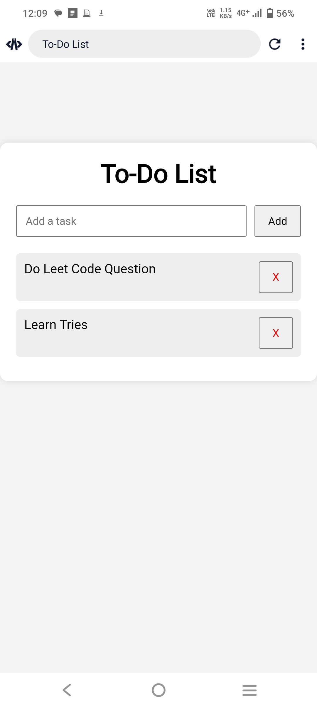

# 📝 TO_DO_LIST

A simple and responsive To-Do List web application built using HTML, CSS, and JavaScript. This application helps users organize their daily tasks efficiently by allowing them to add, complete, and delete tasks. The tasks are stored using the browser's Local Storage, so they remain available even after refreshing or reopening the page.

## Features

- Add new tasks
- Mark tasks as completed
- Delete tasks
- Save tasks using Local Storage
- Responsive and user-friendly interface

## Technologies Used

- HTML5
- CSS3
- JavaScript
- Local Storage API

## Project Structure

```text
TO_DO_LIST
│── index.html
│── style.css
│── script.js
│── README.md
└── images
    └── todo-list.png
```

## Screenshot



## How to Run

1. Download or clone the repository.
2. Open `index.html` in any web browser.
3. Start adding and managing your tasks.

## Author

SOMESWAR NAIK MUDE
